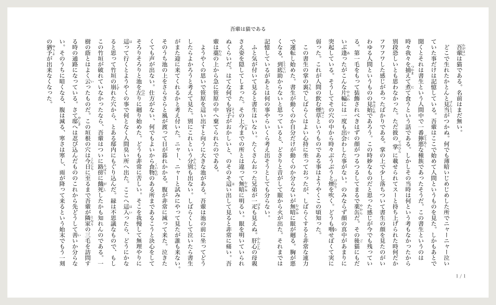
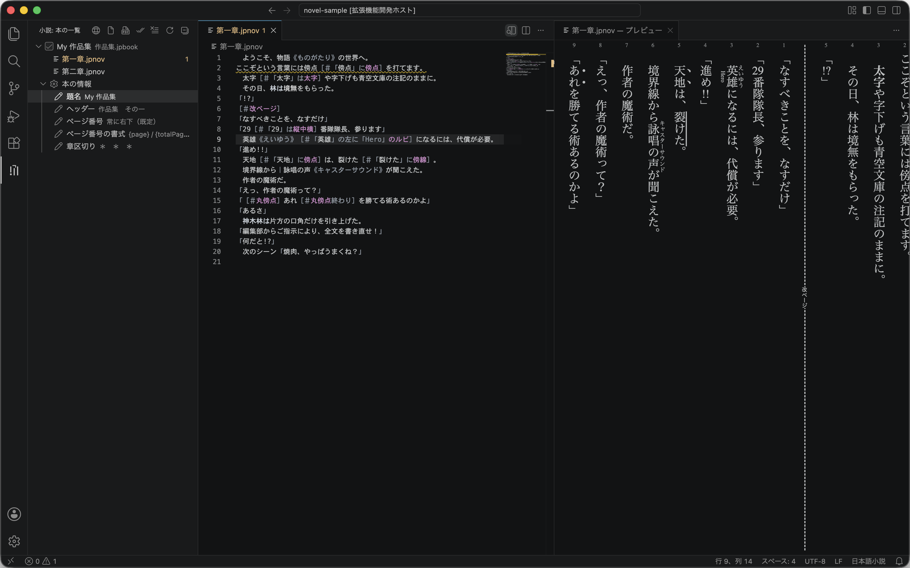
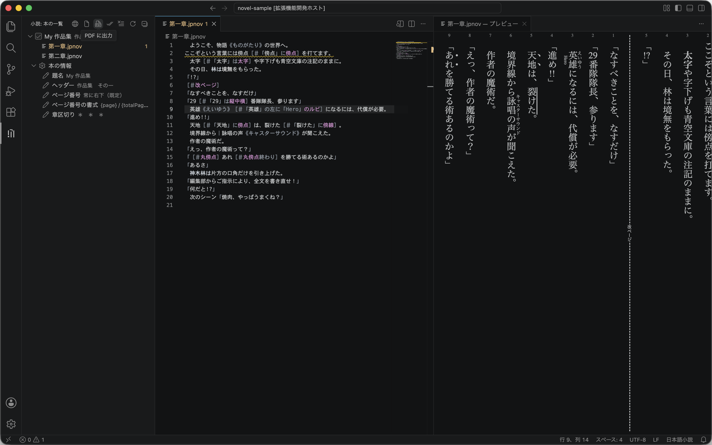
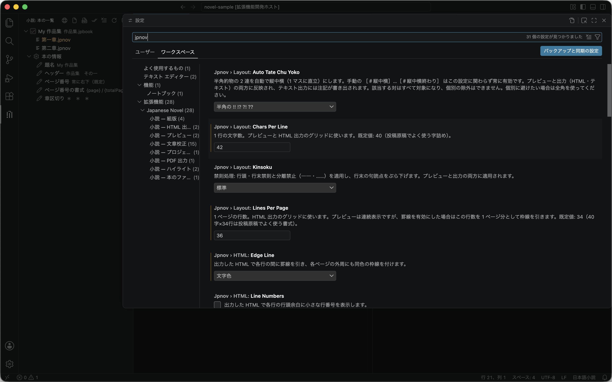
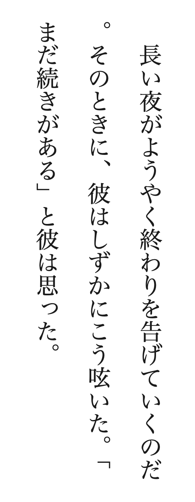
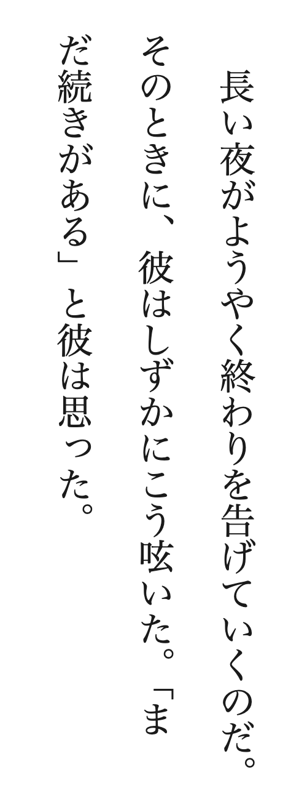
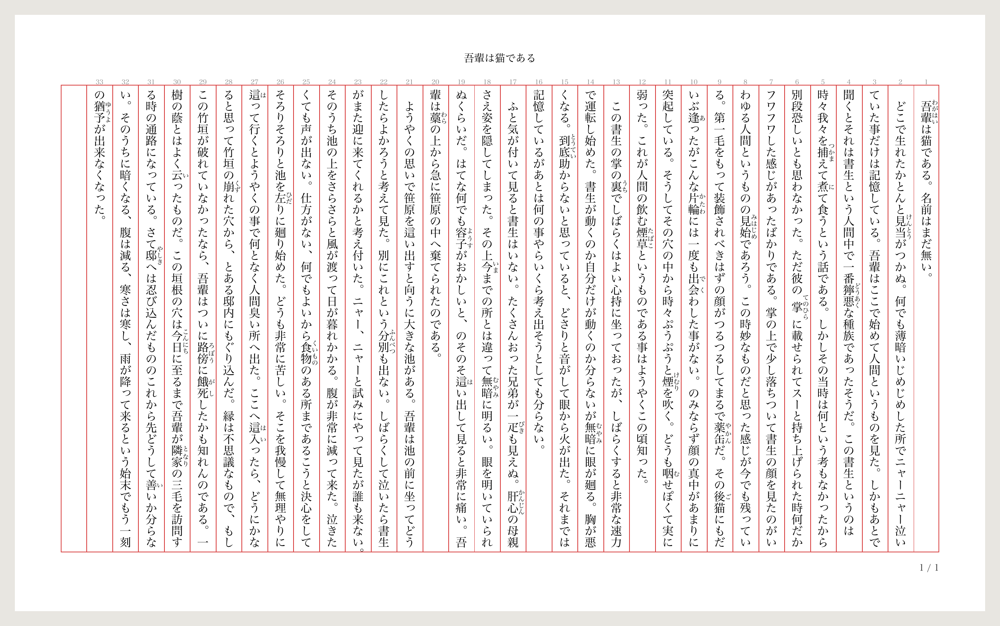
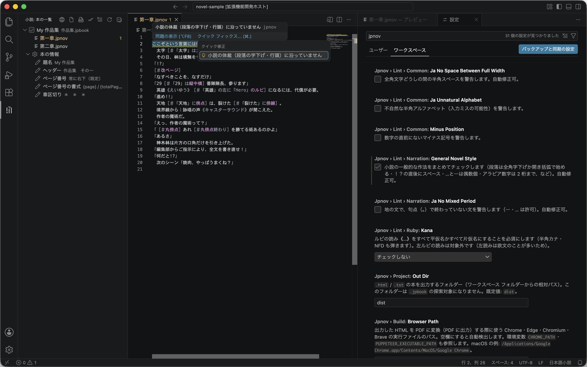
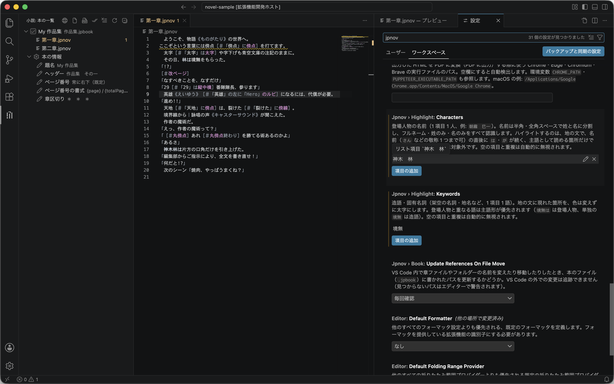

# Japanese Novel

日本語 ｜ [English](./README.en.md)

**書いて、確かめて、一冊にする。すべて縦書きのまま。**



*「PDF に出力」の結果をそのまま画像にしたものです（夏目漱石『吾輩は猫である』・青空文庫より）*

「Japanese Novel」は、無料のエディター「Visual Studio Code（VS Code）」を日本語小説の執筆環境に変える拡張機能です。書いた文章はすぐ隣に縦書きで表示され、章をまとめて HTML・PDF・テキストの「本」として出力できます。記法は[青空文庫の注記][AozoraAnno]そのまま。原稿はただのテキスト ファイルで、特別な形式に囲い込まれることはありません。

## できること

- **縦書きプレビュー** — 書きながら、組み上がった姿をすぐ隣で確認できます。
- **青空文庫の注記に対応** — ルビ・傍点・傍線・太字・斜体・縦中横・改ページなど。
- **本づくり** — 章をまとめて、縦書きの HTML・印刷用の PDF・青空文庫形式のテキストに出力。
- **文章校正** — 目に見えない不正な文字や、投稿前の体裁くずれに気づけます。
- **登場人物と造語のハイライト** — 人物の名前や造語が、地の文で目立つ表示になります。



## この拡張機能の考え方

機能の多さよりも、**執筆の邪魔をしないこと**を大切にしています。

### AI は使いません

小説の投稿や出版では、AI の利用を禁じる編集部や賞が少なくありません。この拡張機能は、**執筆のための AI 機能を一切持ち込みません**。`.jpnov`・`.jpbook` を開いている間は GitHub Copilot 拡張機能も既定で無効になり、入力補完はすべて AI ではない、ふつうのプログラムで動きます。

**執筆は最初から最後まで、人間の手で。**

### 辞書を持ちません

単語辞書から「これは人名らしい」と推測して色を付けるような機能は、あえて持ちません。推測は外れるからです——ありふれた言葉が人名として塗られたり、作品の要になる造語が見過ごされたり。目立たせたい言葉は、[登場人物と造語のハイライト](#登場人物と造語のハイライト)に作者自身が登録します。あなたが大事だと思っていない言葉を、この拡張機能が勝手に目立たせることはありません。[文章校正](#文章校正)も同じ考えで、単語辞書に基づくあいまいな指摘はしません。辞書を積み込まないぶん、動作も軽いままです。

### 入れたら、それだけで動きます

追加のソフトも、プログラムの知識も要りません。プレビューも本づくりも手元のパソコンの中だけで完結するので、オフラインでも使え、原稿がどこかへ送られることもありません（PDF 出力もブラウザーを借りるだけで、ネットにはつなぎません）。プレビューは入力のたびに、待たされずに組み直されます。

### 原稿を囲い込みません

原稿はただのテキスト、記法は昔からある[青空文庫の注記][AozoraAnno]です。章のファイルは `.jpnov`、本のファイルは `.jpbook`。`.txt` や `.md` は読みません。この拡張機能が働くのは、あなたが小説と決めたファイルの上だけです。

## はじめかた

パソコンに慣れていなくても大丈夫です。順番にどうぞ。

1. **VS Code を入れる** — [公式サイト](https://code.visualstudio.com/)から無料でダウンロードして、インストールします。
2. **日本語表示にする** — VS Code を起動したら、左端の四角いブロックのアイコン（拡張機能）をクリックし、検索欄に `Japanese Language Pack` と入力してインストール。案内に従って再起動すると、画面が日本語になります。
3. **この拡張機能を入れる** — 同じ検索欄に `Japanese Novel` と入力してインストールします。
4. **小説のフォルダーを開く** — 原稿を入れるフォルダーを作り、メニューの「ファイル」→「フォルダーを開く」で開きます。「このフォルダー内のファイルの作成者を信頼しますか?」と聞かれたら、「はい、作成者を信頼します」を選んでください。自分で作ったフォルダーなので心配ありません。
5. **章を書く** — 「ファイル」→「新しいテキスト ファイル」で書き始め、保存するときに `第一章.jpnov` のように**名前の末尾を `.jpnov` にします**。この名前が「小説の章」の目印です。
6. **縦書きで確かめる** — `.jpnov` のファイルを開いた状態で、エディター右上の「プレビューを横に開く」アイコンを押すと、隣に縦書きの組み上がりが表示されます。
7. **本のファイルを作る** — 章がいくつかできたら、`作品名.jpbook` というファイルを作り、**読む順に 1 行 1 ファイル**で章の名前を書きます（パスは、開いているフォルダーを起点に数えます）。`.jpbook` 1 つが本 1 冊です。

   ```text
   第一章.jpnov
   第二章.jpnov
   最終章.jpnov
   ```

   冒頭に `---` で挟んだブロックを置くと、題名やヘッダー（ページ上部に入る巻名など）といった**その本自身の情報**も書けます（詳しくは[ページ番号とヘッダー](#ページ番号とヘッダー)）。

   ```text
   ---
   title: 作品名　第一巻
   header: 作品名　一
   ---
   第一章.jpnov
   第二章.jpnov
   最終章.jpnov
   ```

8. **本にする** — 左端のアクティビティ バーに現れる本のアイコン（小説）を開くと、「本の一覧」に今の `.jpbook` が並んでいます。チェックが入っているのを確かめて、一覧の右上の「PDF に出力」を押せば、フォルダー内の `dist` に印刷用の PDF ができあがります。



同じ流れは、「ようこそ」画面（メニューの「ヘルプ」→「ようこそ」）にあるガイド「小説をはじめる」でも案内しています。

## 書き方（青空文庫の注記）

本文はふつうに書くだけです。ルビや傍点を付けたいところにだけ、決まった書き方、[青空文庫の注記][AozoraAnno]を添えます。青空文庫は日本語の電子テキストで長く使われてきた形式なので、原稿がこの拡張機能に縛られることはありません。

多くの注記は、対象の言葉を後ろから指す**前方参照型**が基本です。範囲がわかりにくいときは前後ではさむ**開始／終了型**、複数行にわたるときは開始と終了の注記をそれぞれ 1 行にして囲む**ブロック型**でも書けます。どの形でも仕上がりは同じです。

| やりたいこと | 前方参照型 | 開始／終了型 | ブロック型 |
| --- | --- | --- | --- |
| ルビを振る | `漢字《かんじ》` | `｜お茶の間《おちゃのま》` | — |
| 左側にルビを振る | `英雄［＃「英雄」の左に「ヒーロー」のルビ］` | — | — |
| 傍点を打つ | `言葉［＃「言葉」に傍点］` | `［＃傍点］嬉しい［＃傍点終わり］` | — |
| 傍線を引く | `言葉［＃「言葉」に傍線］`（傍線・二重傍線・鎖線・破線・波線） | `［＃傍線］大事な約束［＃傍線終わり］` | — |
| 太字にする | `言葉［＃「言葉」は太字］` | `［＃太字］ここぞ［＃太字終わり］` | `［＃ここから太字］…［＃ここで太字終わり］` |
| 斜体にする | `言葉［＃「言葉」は斜体］` | `［＃斜体］そっと［＃斜体終わり］` | `［＃ここから斜体］…［＃ここで斜体終わり］` |
| 数字などを 1 マスに収める（縦中横） | `42［＃「42」は縦中横］` | `［＃縦中横］12［＃縦中横終わり］` | — |
| 見出しを付ける | `第一章［＃「第一章」は大見出し］`（大見出し・中見出し・小見出し） | `［＃大見出し］第一章［＃大見出し終わり］` | `［＃ここから大見出し］…［＃ここで大見出し終わり］` |
| 字下げする | 一般的には全角スペース、必要なら行の頭で`［＃２字下げ］`（数字は全角で） | — | `［＃ここから２字下げ］…［＃ここで字下げ終わり］` |
| ページを改める | `［＃改ページ］`（行の頭で） | — | — |


上の見本の原稿はこちらです。コピーしてそのまま試せます。

```text
　物語《ものがたり》が始まる。
　｜お茶の間《おちゃのま》へ届け。
　覚悟［＃「覚悟」に傍点］を決めた。
　運命［＃「運命」に波線］が動く。
　英雄《えいゆう》［＃「英雄」の左に「ヒーロー」のルビ］の登場。
　第42［＃「42」は縦中横］話、太字［＃「太字」は太字］で。
「何だと!?」
```

覚えておくと便利なこと：

- 注記の `［＃…］` は**すべて全角**で書きます。半角の `[#…]` は効きません。
- `!?` `!!` のような半角 2 文字の組は、注記を書かなくても自動で 1 マスに収まります（自動縦中横）。
- 見出しの注記を書いても、章が分かれるわけではありません。**章＝ 1 ファイル**が区切りです。
- 対応していない注記はメモ扱いになり、出力には現れません。書きかけの注記（`］` の閉じ忘れ）は波線でお知らせします。

## 縦書きプレビュー

エディター右上の「プレビューを横に開く」で、隣のパネルに組み上がりが表示されます。

- 入力するたびに、すぐ反映されます。
- エディターでカーソルを動かすと、プレビューも同じ場所まで追いかけます。
- 行の折り返しや禁則処理は、出力される本とまったく同じ計算です。
- `［＃改ページ］` は破線の目印として表示されます。行番号は改ページごとに 1 から数え直します。

行番号を消したいときや、原稿用紙のような罫線を出したいときは、設定「小説 — プレビュー」で選べます。

## 本にする（HTML・PDF・テキスト）

`.jpbook` は「本に載せる章を、読む順に並べた目次」です。ファイル名の順でもフォルダーの順でもなく、この目次だけが本の中身と順序を決めます。この仕組みは、長い作品ほど効いてきます。

- **巻ごとに 1 冊** — 長編は `第一巻.jpbook`・`第二巻.jpbook` と分ければ、最新巻だけを 1 つの PDF にして編集部に渡せます。書き溜めた全章がまるごと 1 冊に繋がってしまうことはありません。
- **載せない章は、本に入りません** — 同じ第一章の別稿をいくつか持っておき、投稿先に合わせて目次の 1 行だけ差し替える、という使い方ができます。
- **ファイル名は自由** — 順序は目次が決めるので、章のファイルにどんな名前を付けても、あとで名前を変えても、本の並びは崩れません。

本にするには、アクティビティ バーの「小説」を開き、出力したい本にチェックを入れて、「本の一覧」の右上のボタンで出力します。

- **PDF に出力** — 印刷用の PDF。
- **HTML に出力** — ページ組版の縦書き HTML。ブラウザーで開け、1 ファイルで完結します。
- **テキストに出力** — 章をつないだ青空文庫形式のテキスト。投稿サイトや他のソフトへの受け渡しに。

出力先はフォルダー内の `dist` です（設定「小説 — プロジェクト」で変更できます）。章と本のファイルはフォルダー分けしても大丈夫で、並びはそのまま出力先に反映されます。

**「本の一覧」から直接整えることもできます** — 本の行を開くと「本の情報」と章の一覧が現れます。`+` で章を追加、ドラッグ（または右クリック）で並べ替え、「本の情報」の各行をクリックすると題名・ヘッダー・ページ番号をその場で編集できます。どの操作も `.jpbook` の中身をそのまま書き換えるので、手で書いた場合と完全に同じ結果になります。


章のファイル名を VS Code 内で変えたり移動したりすると、参照している `.jpbook` のパスを更新するか確認が出ます（設定「小説 — 本のファイル」で「常に更新」「更新しない」に変えられます）。VS Code の外で変えた場合は追跡できないので、`.jpbook` の該当行に赤い波線でお知らせします。

> **PDF 出力には Google Chrome か Microsoft Edge が必要です**（Chromium・Brave でも可）。パソコンに入っていれば自動で見つけます。見つからないときは、代わりに HTML を出力してお知らせしますので、ブラウザーを入れるか、設定「小説 — PDF 出力」で場所を指定してください。

## 組版の設定

既定の組版は **40字×34行**。投稿原稿でよく使われる書式です。字数と行数は設定「小説 — 組版」で変えられます。

設定を開くには：左下の歯車 →「設定」→ 検索欄に `jpnov`（章ファイルの拡張子と同じ綴り・半角）と入力すると、この拡張機能の設定だけが並びます。プログラムの知識は要りません。



### 禁則処理

行の頭に句読点が来ない、行の末尾にかぎ括弧の開き（「）が残らない――日本語組版の約束事は、既定で守られます。

| 禁則処理なし | 禁則処理あり（既定） |
| :---: | :---: |
|  |  |

行末の句読点は「ぶら下げ」で処理します。中点なども対象にしたい場合は、設定で「厳格」を選べます。

### 原稿用紙風の表示

罫線と行番号をオンにすると、原稿用紙のような見た目になります。プレビューは「小説 — プレビュー」、出力は「小説 — HTML 出力」で、それぞれ選べます。



*罫線を「赤」、行番号をオンにした PDF 出力例*

### ページ番号とヘッダー

HTML と PDF には、ページ番号とヘッダー（ページ上部の題名）が入ります。これらは**本ごとの情報**なので、設定画面ではなく `.jpbook` の冒頭に書きます。同じフォルダーで第一巻と第二巻を作っても、ヘッダーをそれぞれ変えられます。章と章の間に入れる区切り記号（章区切り）も、同じ場所で指定します。

```text
---
title: 作品名　第一巻
header: 作品名　一
pageNumber: right
pageNumberFormat: {page} / {totalPage}
divider: ＊　＊　＊
---
第一章.jpnov
```

- `title` — 本の題名。「本の一覧」の表示名になります。
- `header` — ヘッダー（ページ上部の中央に入る文字）。書かなければ何も表示されません。
- `pageNumber` — ページ番号の位置。`right`（常に右下、既定）・`left`（常に左下）・`rightLeft`（右下・左下を交互）・`leftRight`（左下・右下を交互）・`none`（表示しない）。
- `pageNumberFormat` — ページ番号の書式。`{page}`（ページ番号）と `{totalPage}`（総ページ数）が使えます。既定は `{page} / {totalPage}`。
- `divider` — 章区切り。章と章の間に入れる記号です（例：`＊`・`＊　＊　＊`・`◇`）。次の章が見出しで始まる場合は入りません。そのまま書けば出力時に天地中央揃えになり、`［＃３字下げ］＊` のように書けば字下げで入ります。書かなければ章の間は空行だけになります。

どれも書かなくてかまいません（書いた分だけ既定から変わります）。編集中はキー名や値の候補が自動で出ます。「本の一覧」パネルの「本の情報」からも、同じ内容をクリックで編集できます。

## 文章校正

書いている間、原稿を静かに点検します。

点検は、地の文・台詞・ルビの読みを区別して行われます。地の文向けの文体の規則が台詞の言い回しにまで適用されて、会話のたびに波線が付く、ということはありません。単語辞書による推測もしないので、作品の固有名詞が誤字扱いされることもありません。

- **既定でオン** — 半角カナ、壊れた文字（NFD）、ゼロ幅スペース、不正な制御文字。コピー＆ペーストで紛れ込む「見えない事故」を防ぎます。
- **投稿前にオン** — 段落頭の字下げや地の文の句点、一文の長さ、読点の数、括弧の閉じ忘れなど。設定「小説 — 文章校正」で必要なものだけ選べます。

指摘は波線で表示され、多くは電球アイコンから自動修正できます。まとめて直したいときは「自動修正できる問題をすべて修正」も使えます。下書きの間はオフにしておき、投稿前だけオンにする、という使い方がおすすめです。



## 登場人物と造語のハイライト

登場人物の名前と、作品だけの造語を登録しておくと、執筆中に目立つ表示になります。日本語は主語が省略されがちなので、「いま誰の場面か」を見失いにくくなります。

色が付くのは、登録した言葉だけです。辞書で推測しないので、関係ないふつうの言葉が塗られることはなく、どんなに珍しい名前や造語でも取りこぼしません。

- **登場人物**は、主語として読める場所（「林は」「神木ちゃんが」など）だけ色が付きます。会話「」の中は染めません。
- **造語**は地の文で太字になります。

登録は、設定「小説 — ハイライト」の「項目の追加」から。フォルダーごとに設定できるので、作品ごとに別の人物表を持てます。



## よくある質問

**Q. 原稿が独自の形式に囲い込まれませんか？**
いいえ。`.jpnov` も `.jpbook` も中身はただのテキストです。どのエディターでも開けますし、[青空文庫の注記][AozoraAnno]はこの拡張機能がなくても意味が通ります。

**Q. いま書いている原稿からの引っ越しは大変ですか？**
本文を `.jpnov` ファイルに貼り付けるだけです。Word などの装飾（ルビや太字）は引き継がれないので、注記で付け直してください。

**Q. 原稿はどこかに送信されますか？**
いいえ。原稿は手元のフォルダーに保存されるだけで、この拡張機能が外部へ送ることはありません。

**Q. 電球アイコンのメニューに、✨ マーク付きの「Fix」など見覚えのない項目が出てきます。**
それは VS Code 本体に組み込まれている AI 機能（GitHub Copilot）のもので、この拡張機能とは関係ありません。押さない限り、何かが動くことはありません。表示そのものを消したい場合は、設定の検索欄に `chat.disableAIFeatures` と入力し、出てきた項目にチェックを入れてください。AI 関連の表示がまとめて消えます。

**Q. 自分は Copilot を使いたいのですが。**
`.jpnov`・`.jpbook` では既定で無効にしていますが、設定の `github.copilot.enable` を上書きすれば戻せます。有効にする場合は**自己責任**でお願いします。

**Q. 見出しや目次ページは作れますか？**
見出しは注記で付けられます（[書き方の表](#書き方青空文庫の注記)をどうぞ）。付けた行はゴシック体の太字になり、字の大きさは変わりません。目次ページはいまのところ作れません。章＝ 1 ファイルで区切り、`.jpbook` の並び順がそのまま本の順序になります。

## ライセンス

このプロジェクトは MIT ライセンスで公開されています。詳しくは [LICENSE](./LICENSE) をご覧ください。

[AozoraAnno]: https://www.aozora.gr.jp/annotation/index.html
